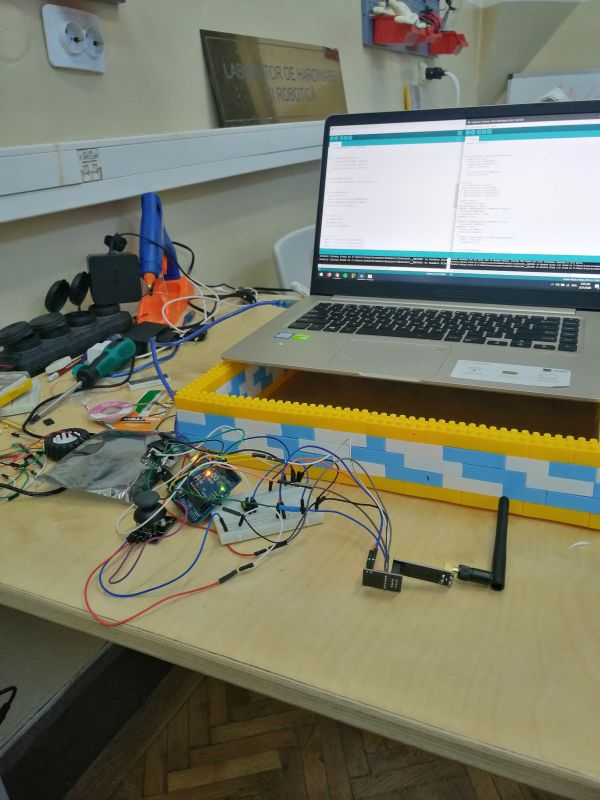
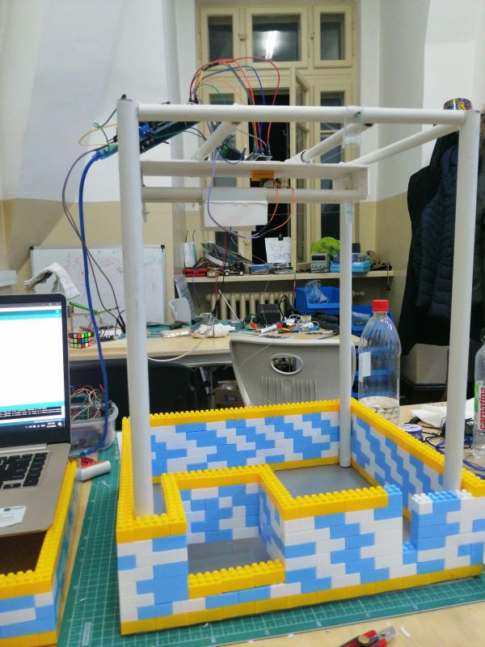

# CANDY CLAW MACHINE ARCADE GAME
#### For our final project in the "Introduction To Robotics" course, [@Diana](https://github.com/dianapaula19) and I decided decided to create a candy claw machine, because we considered it to be a pretty "sweet" idea.

## DEMO VIDEO
Link to the video: http://bit.do/videoFinalProject

## THE RESEARCH
We made a lot of research beforehand and watched a tons of youtube tutorials in order to create this machine. 

- the movement of the claw along the axes was inspired from the following tutorial: http://bit.do/clawMovementXYZ, however instead of cardboard we used hobbyglas and instead of the elastic band we used a nylon wire.

The improvement we brought to all of these tutorials was adding two nrf24l01 tranceivers that reduces substantially the number of wires. There's a transmitter at the base of the machine that sends data to the motors found on the top of the machine. 

## PICS 📷

## HARDWARE 
- 4 N20 dc motors
- 1 SG90 servo motor
- L293D driver shield for 4 motors
- 2 arduino Mega 2560
- 2 HC-SR04 Ultrasonics :radio_button: :radio_button: 
- 2 9 V batteries
- 2 joysticks 🕹️
- 1 pushbutton
- 1 16/2 lcd
- 2 nrf24l01 transceivers 
- **LOTS** of wires
- legos 🧱
- hobbyglas and transparent plexiglass
- plastic tubes
- nylon wire
- superglue
- ~~our tears~~

Link to the BOM: http://bit.do/clawMachineBOM

## HOW TO PLAY

1. In order to start playing the game, you need to insert a coin. After the completion of this simple task, all you need to do is to switch to the console and press the start button.   
2. The claw is controlled by two joysticks. One of the them controls the movement on the X and Y axes, while the other one control the movement on the Z axis. Also, pressing the button of the latter joystick open and closes the claw, allowing you to grab that candy.
3. You have exactly three minutes to grab a prize, after that the game is over and you need to insert another coin to start again. 

## ISSUES

Our project is not fully functional and it has this following issues:
1. the motors aren't working properly even though the console's transceiver is sending the correct data
2. the Servo motor responsible for the opening and closing mechanism of the claw doesn't have enough power to function when the rest of the motors are connected
3. even though the ultrasonics are working properly, they still can't detect the insertion of the coin

## WHAT WE'VE LEARNED 📕

While making this project we've learned the following things:
1. that 5 motors require a lot more power than expected in order to function properly
2. how tranceivers send and receive data
3. how to use pulleys to make an object lighter

We also made a pretty cool guide to this game: http://bit.do/clawMachineGuide

